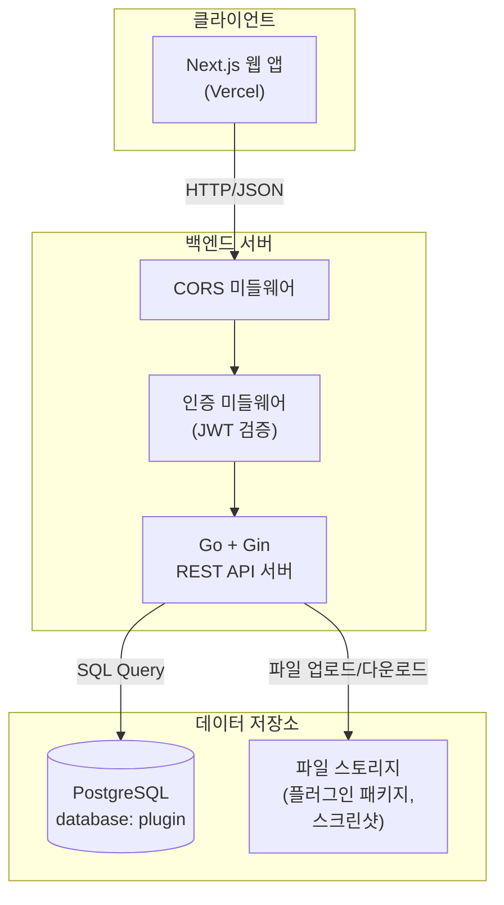
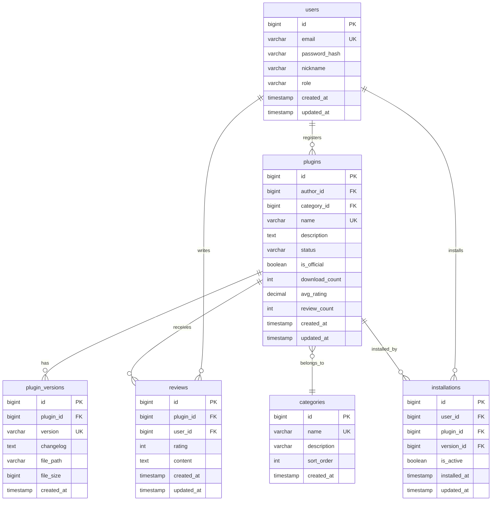
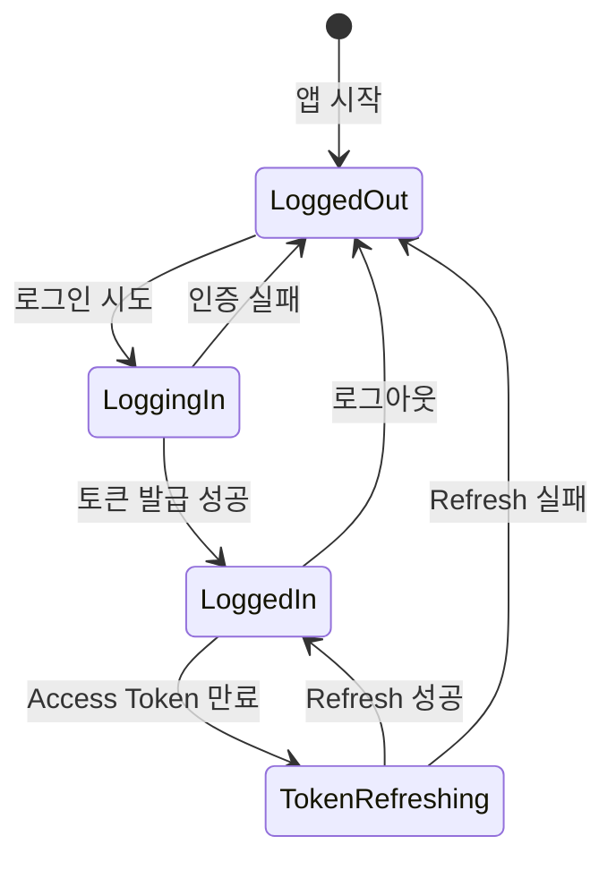
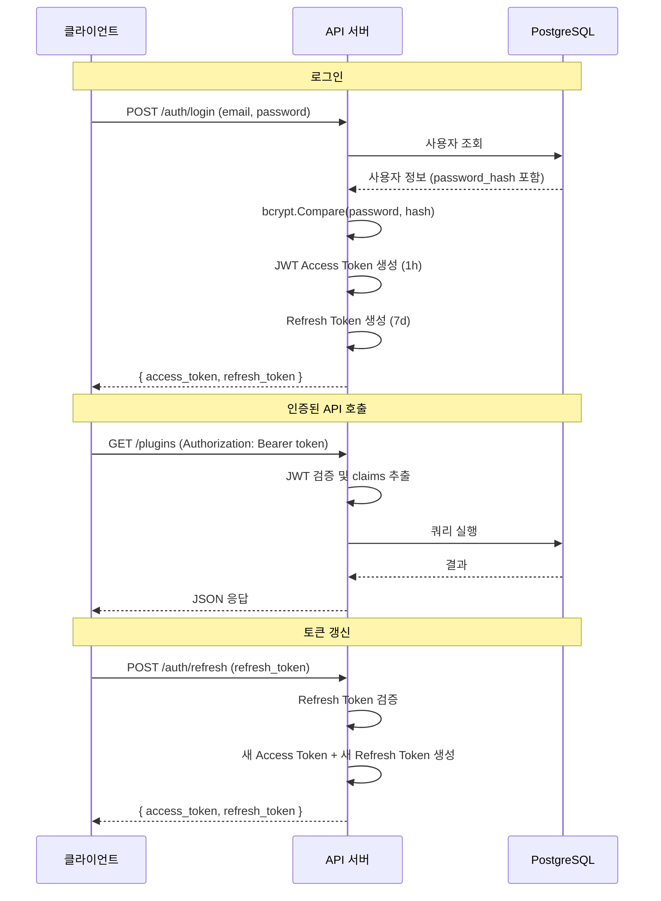

# 시스템 설계서: KTC Claude Plugin Hub

## 1. 프로젝트 개요

| 항목 | 내용 |
|---|---|
| 프로젝트명 | KTC Claude Plugin Hub |
| 한 줄 설명 | 클로드 코드 플러그인을 검색·설치·관리하고, 개발자가 직접 플러그인을 배포할 수 있는 통합 웹 플랫폼 |
| 기술 스택 | Next.js, Tailwind CSS, Go, Gin, PostgreSQL, JWT |
| 작성일 | 2026-04-14 |
| 기반 문서 | prd.md |

---

## 2. 전체 시스템 아키텍처



### 통신 규칙
- 클라이언트 ↔ API 서버 간 통신은 반드시 JSON 포맷 사용
- 요청 헤더에 `Content-Type: application/json`과 `Accept: application/json` 포함
- 비정상 응답(HTML, 빈 값 등)은 API 서버에서 통일된 JSON 에러 포맷으로 변환

---

## 3. 데이터베이스 모델링

### ERD



### 테이블 상세 명세

#### users

| 컬럼명 | 타입 | 제약조건 | 설명 |
|---|---|---|---|
| id | BIGSERIAL | PK | 사용자 고유 ID |
| email | VARCHAR(255) | UNIQUE, NOT NULL | 로그인 이메일 |
| password_hash | VARCHAR(255) | NOT NULL | bcrypt 해싱된 비밀번호 |
| nickname | VARCHAR(50) | NOT NULL | 표시 이름 |
| role | VARCHAR(20) | NOT NULL, DEFAULT 'user' | 역할 (user / admin) |
| created_at | TIMESTAMP | NOT NULL, DEFAULT NOW() | 가입일시 |
| updated_at | TIMESTAMP | NOT NULL, DEFAULT NOW() | 수정일시 |

- 인덱스: `idx_users_email` (email)

#### categories

| 컬럼명 | 타입 | 제약조건 | 설명 |
|---|---|---|---|
| id | BIGSERIAL | PK | 카테고리 고유 ID |
| name | VARCHAR(50) | UNIQUE, NOT NULL | 카테고리명 |
| description | VARCHAR(255) | | 카테고리 설명 |
| sort_order | INT | NOT NULL, DEFAULT 0 | 정렬 순서 |
| created_at | TIMESTAMP | NOT NULL, DEFAULT NOW() | 생성일시 |

#### plugins

| 컬럼명 | 타입 | 제약조건 | 설명 |
|---|---|---|---|
| id | BIGSERIAL | PK | 플러그인 고유 ID |
| author_id | BIGINT | FK → users.id, NOT NULL | 등록자 |
| category_id | BIGINT | FK → categories.id, NOT NULL | 카테고리 |
| name | VARCHAR(100) | UNIQUE, NOT NULL | 플러그인명 |
| description | TEXT | NOT NULL | 상세 설명 |
| status | VARCHAR(20) | NOT NULL, DEFAULT 'pending' | 상태 (pending / approved / rejected / hidden) |
| is_official | BOOLEAN | NOT NULL, DEFAULT FALSE | 공식 플러그인 여부 |
| download_count | INT | NOT NULL, DEFAULT 0 | 다운로드 횟수 |
| avg_rating | DECIMAL(2,1) | NOT NULL, DEFAULT 0.0 | 평균 평점 |
| review_count | INT | NOT NULL, DEFAULT 0 | 리뷰 수 |
| created_at | TIMESTAMP | NOT NULL, DEFAULT NOW() | 등록일시 |
| updated_at | TIMESTAMP | NOT NULL, DEFAULT NOW() | 수정일시 |

- 인덱스: `idx_plugins_author` (author_id), `idx_plugins_category` (category_id), `idx_plugins_status` (status), `idx_plugins_official_status` (is_official, status)

#### plugin_versions

| 컬럼명 | 타입 | 제약조건 | 설명 |
|---|---|---|---|
| id | BIGSERIAL | PK | 버전 고유 ID |
| plugin_id | BIGINT | FK → plugins.id, NOT NULL | 플러그인 |
| version | VARCHAR(20) | NOT NULL | 버전 번호 (semver) |
| changelog | TEXT | | 변경 사항 |
| file_path | VARCHAR(500) | NOT NULL | 패키지 파일 경로 |
| file_size | BIGINT | NOT NULL | 파일 크기 (bytes) |
| created_at | TIMESTAMP | NOT NULL, DEFAULT NOW() | 업로드일시 |

- 유니크 제약: `uq_plugin_version` (plugin_id, version)
- 인덱스: `idx_versions_plugin` (plugin_id)

#### reviews

| 컬럼명 | 타입 | 제약조건 | 설명 |
|---|---|---|---|
| id | BIGSERIAL | PK | 리뷰 고유 ID |
| plugin_id | BIGINT | FK → plugins.id, NOT NULL | 대상 플러그인 |
| user_id | BIGINT | FK → users.id, NOT NULL | 작성자 |
| rating | INT | NOT NULL, CHECK (1~5) | 평점 |
| content | TEXT | NOT NULL | 리뷰 내용 |
| created_at | TIMESTAMP | NOT NULL, DEFAULT NOW() | 작성일시 |
| updated_at | TIMESTAMP | NOT NULL, DEFAULT NOW() | 수정일시 |

- 유니크 제약: `uq_review_user_plugin` (plugin_id, user_id) — 1인 1리뷰
- 인덱스: `idx_reviews_plugin` (plugin_id)

#### installations

| 컬럼명 | 타입 | 제약조건 | 설명 |
|---|---|---|---|
| id | BIGSERIAL | PK | 설치 고유 ID |
| user_id | BIGINT | FK → users.id, NOT NULL | 설치 사용자 |
| plugin_id | BIGINT | FK → plugins.id, NOT NULL | 설치 플러그인 |
| version_id | BIGINT | FK → plugin_versions.id, NOT NULL | 설치 버전 |
| is_active | BOOLEAN | NOT NULL, DEFAULT TRUE | 활성화 상태 |
| installed_at | TIMESTAMP | NOT NULL, DEFAULT NOW() | 설치일시 |
| updated_at | TIMESTAMP | NOT NULL, DEFAULT NOW() | 수정일시 |

- 유니크 제약: `uq_installation_user_plugin` (user_id, plugin_id)
- 인덱스: `idx_installations_user` (user_id), `idx_installations_plugin` (plugin_id)

---

## 4. 핵심 API 인터페이스 명세

### 기본 규칙
- Base URL: `/api/v1`
- 인증: `Authorization: Bearer <access_token>`
- 에러 응답: RFC 7807 Problem Details 형식

### 에러 응답 공통 포맷

```json
{
  "type": "ERROR_CODE",
  "title": "에러 제목",
  "status": 400,
  "detail": "상세 에러 메시지"
}
```

---

### 4.1 인증 API

#### POST /api/v1/auth/register
**설명**: 회원가입
**인증**: 불필요

**Request Body**:
```json
{
  "email": "string (required, 이메일 형식)",
  "password": "string (required, 8자 이상, 영문+숫자)",
  "nickname": "string (required, 2-50자)"
}
```

**Response 201**:
```json
{
  "id": 1,
  "email": "user@example.com",
  "nickname": "username",
  "role": "user",
  "created_at": "2026-04-14T00:00:00Z"
}
```

**에러 응답**:

| 코드 | type | 설명 |
|---|---|---|
| 400 | INVALID_INPUT | 필수 필드 누락 또는 형식 오류 |
| 409 | DUPLICATE_EMAIL | 이미 가입된 이메일 |

#### POST /api/v1/auth/login
**설명**: 로그인
**인증**: 불필요

**Request Body**:
```json
{
  "email": "string (required)",
  "password": "string (required)"
}
```

**Response 200**:
```json
{
  "access_token": "string (JWT)",
  "refresh_token": "string",
  "expires_in": 3600
}
```

**에러 응답**:

| 코드 | type | 설명 |
|---|---|---|
| 401 | INVALID_CREDENTIALS | 이메일 또는 비밀번호 불일치 |

#### POST /api/v1/auth/refresh
**설명**: 토큰 갱신
**인증**: 불필요

**Request Body**:
```json
{
  "refresh_token": "string (required)"
}
```

**Response 200**:
```json
{
  "access_token": "string (JWT)",
  "refresh_token": "string",
  "expires_in": 3600
}
```

---

### 4.2 플러그인 API

#### GET /api/v1/plugins
**설명**: 플러그인 목록 조회 (공개된 플러그인만)
**인증**: 불필요

**Query Params**:

| 파라미터 | 타입 | 설명 |
|---|---|---|
| category_id | int | 카테고리 필터 |
| keyword | string | 검색 키워드 (이름, 설명) |
| sort | string | 정렬 기준 (popular / latest / rating) |
| page | int | 페이지 번호 (기본 1) |
| size | int | 페이지 크기 (기본 20, 최대 50) |

**Response 200**:
```json
{
  "data": [
    {
      "id": 1,
      "name": "plugin-name",
      "description": "설명",
      "author": { "id": 1, "nickname": "작성자" },
      "category": { "id": 1, "name": "카테고리명" },
      "is_official": true,
      "download_count": 1234,
      "avg_rating": 4.5,
      "review_count": 23,
      "latest_version": "1.2.0",
      "created_at": "2026-04-14T00:00:00Z"
    }
  ],
  "total": 100,
  "page": 1,
  "size": 20
}
```

#### GET /api/v1/plugins/:id
**설명**: 플러그인 상세 조회
**인증**: 불필요

**Response 200**:
```json
{
  "id": 1,
  "name": "plugin-name",
  "description": "상세 설명",
  "author": { "id": 1, "nickname": "작성자" },
  "category": { "id": 1, "name": "카테고리명" },
  "status": "approved",
  "is_official": true,
  "download_count": 1234,
  "avg_rating": 4.5,
  "review_count": 23,
  "versions": [
    { "id": 1, "version": "1.2.0", "changelog": "변경사항", "created_at": "..." }
  ],
  "created_at": "2026-04-14T00:00:00Z",
  "updated_at": "2026-04-14T00:00:00Z"
}
```

**에러 응답**:

| 코드 | type | 설명 |
|---|---|---|
| 404 | NOT_FOUND | 플러그인 없음 또는 비공개 |

#### POST /api/v1/plugins
**설명**: 플러그인 등록
**인증**: Bearer Token 필수

**Request Body** (multipart/form-data):

| 필드 | 타입 | 설명 |
|---|---|---|
| name | string | 플러그인명 (required, 1-100자) |
| description | string | 상세 설명 (required) |
| category_id | int | 카테고리 ID (required) |
| version | string | 초기 버전 (required, semver) |
| changelog | string | 변경 사항 |
| file | file | 플러그인 패키지 파일 (required) |
| screenshots | file[] | 스크린샷 (선택, 최대 5장) |

**Response 201**:
```json
{
  "id": 1,
  "name": "plugin-name",
  "status": "pending",
  "is_official": false,
  "created_at": "2026-04-14T00:00:00Z"
}
```

**비즈니스 규칙**:
- 관리자가 등록 시: `status = "approved"`, `is_official = true`
- 일반 사용자 등록 시: `status = "pending"`, `is_official = false`

**에러 응답**:

| 코드 | type | 설명 |
|---|---|---|
| 400 | INVALID_INPUT | 필수 필드 누락 또는 형식 오류 |
| 409 | DUPLICATE_NAME | 중복 플러그인명 |

#### PUT /api/v1/plugins/:id
**설명**: 플러그인 수정
**인증**: Bearer Token 필수 (본인 또는 관리자)

**Request Body**:
```json
{
  "name": "string (optional)",
  "description": "string (optional)",
  "category_id": "int (optional)"
}
```

**Response 200**: 수정된 플러그인 객체

**에러 응답**:

| 코드 | type | 설명 |
|---|---|---|
| 403 | FORBIDDEN | 수정 권한 없음 |
| 404 | NOT_FOUND | 플러그인 없음 |

#### DELETE /api/v1/plugins/:id
**설명**: 플러그인 삭제
**인증**: Bearer Token 필수 (본인 또는 관리자)

**Response 204**: No Content

**에러 응답**:

| 코드 | type | 설명 |
|---|---|---|
| 403 | FORBIDDEN | 삭제 권한 없음 |

---

### 4.3 버전 API

#### POST /api/v1/plugins/:id/versions
**설명**: 새 버전 업로드
**인증**: Bearer Token 필수 (본인 또는 관리자)

**Request Body** (multipart/form-data):

| 필드 | 타입 | 설명 |
|---|---|---|
| version | string | 버전 번호 (required, semver) |
| changelog | string | 변경 사항 |
| file | file | 플러그인 패키지 파일 (required) |

**Response 201**:
```json
{
  "id": 1,
  "plugin_id": 1,
  "version": "1.3.0",
  "changelog": "변경 사항",
  "file_size": 102400,
  "created_at": "2026-04-14T00:00:00Z"
}
```

**에러 응답**:

| 코드 | type | 설명 |
|---|---|---|
| 409 | DUPLICATE_VERSION | 중복 버전 번호 |

#### GET /api/v1/plugins/:id/versions/:versionId/download
**설명**: 플러그인 파일 다운로드
**인증**: Bearer Token 필수

**Response 200**: 파일 바이너리 (Content-Disposition: attachment)

**부수 효과**: `plugins.download_count` 1 증가

---

### 4.4 설치 API

#### POST /api/v1/plugins/:id/install
**설명**: 플러그인 설치
**인증**: Bearer Token 필수

**Request Body**:
```json
{
  "version_id": "int (optional, 미지정 시 최신 버전)"
}
```

**Response 201**:
```json
{
  "id": 1,
  "plugin_id": 1,
  "version_id": 1,
  "is_active": true,
  "installed_at": "2026-04-14T00:00:00Z"
}
```

#### DELETE /api/v1/plugins/:id/install
**설명**: 플러그인 삭제 (내 설치 목록에서 제거)
**인증**: Bearer Token 필수

**Response 204**: No Content

#### PATCH /api/v1/plugins/:id/install
**설명**: 플러그인 활성화/비활성화 토글
**인증**: Bearer Token 필수

**Request Body**:
```json
{
  "is_active": true
}
```

**Response 200**: 수정된 설치 객체

#### GET /api/v1/me/installations
**설명**: 내 설치 플러그인 목록
**인증**: Bearer Token 필수

**Response 200**:
```json
{
  "data": [
    {
      "id": 1,
      "plugin": { "id": 1, "name": "plugin-name", "is_official": true },
      "version": { "id": 1, "version": "1.2.0" },
      "is_active": true,
      "installed_at": "2026-04-14T00:00:00Z"
    }
  ]
}
```

---

### 4.5 리뷰 API

#### GET /api/v1/plugins/:id/reviews
**설명**: 플러그인 리뷰 목록
**인증**: 불필요

**Query Params**: `page`, `size`

**Response 200**:
```json
{
  "data": [
    {
      "id": 1,
      "user": { "id": 1, "nickname": "작성자" },
      "rating": 5,
      "content": "리뷰 내용",
      "created_at": "2026-04-14T00:00:00Z"
    }
  ],
  "total": 10,
  "page": 1,
  "size": 20
}
```

#### POST /api/v1/plugins/:id/reviews
**설명**: 리뷰 작성
**인증**: Bearer Token 필수

**Request Body**:
```json
{
  "rating": "int (required, 1-5)",
  "content": "string (required, 1-1000자)"
}
```

**Response 201**: 생성된 리뷰 객체

**비즈니스 규칙**:
- 플러그인 작성자는 본인 플러그인에 리뷰 불가
- 플러그인당 1인 1리뷰
- 리뷰 작성/수정/삭제 시 `plugins.avg_rating`, `plugins.review_count` 재계산

**에러 응답**:

| 코드 | type | 설명 |
|---|---|---|
| 403 | SELF_REVIEW | 본인 플러그인에 리뷰 불가 |
| 409 | DUPLICATE_REVIEW | 이미 리뷰 작성됨 |

#### PUT /api/v1/plugins/:id/reviews/:reviewId
**설명**: 리뷰 수정
**인증**: Bearer Token 필수 (본인만)

#### DELETE /api/v1/plugins/:id/reviews/:reviewId
**설명**: 리뷰 삭제
**인증**: Bearer Token 필수 (본인 또는 관리자)

---

### 4.6 카테고리 API

#### GET /api/v1/categories
**설명**: 카테고리 목록
**인증**: 불필요

**Response 200**:
```json
{
  "data": [
    { "id": 1, "name": "개발 도구", "description": "설명", "sort_order": 1 }
  ]
}
```

---

### 4.7 관리자 API

#### GET /api/v1/admin/plugins/pending
**설명**: 심사 대기 플러그인 목록
**인증**: Bearer Token 필수 (관리자)

#### PATCH /api/v1/admin/plugins/:id/approve
**설명**: 플러그인 승인
**인증**: Bearer Token 필수 (관리자)

**Response 200**: 승인된 플러그인 객체 (status: "approved")

#### PATCH /api/v1/admin/plugins/:id/reject
**설명**: 플러그인 반려
**인증**: Bearer Token 필수 (관리자)

**Request Body**:
```json
{
  "reason": "string (required, 반려 사유)"
}
```

**Response 200**: 반려된 플러그인 객체 (status: "rejected")

#### PATCH /api/v1/admin/plugins/:id/hide
**설명**: 플러그인 비공개 처리
**인증**: Bearer Token 필수 (관리자)

**Response 200**: 비공개 처리된 플러그인 객체 (status: "hidden")

---

### 4.8 사용자 프로필 API

#### GET /api/v1/me
**설명**: 내 정보 조회
**인증**: Bearer Token 필수

#### GET /api/v1/me/plugins
**설명**: 내가 등록한 플러그인 목록
**인증**: Bearer Token 필수

---

## 5. 폴더 구조 및 컴포넌트 분리 전략

### 프론트엔드 (Next.js)

```
frontend/
├── public/                    # 정적 파일
├── src/
│   ├── app/                   # App Router 페이지
│   │   ├── layout.tsx         # 루트 레이아웃 (네비게이션, 테마)
│   │   ├── page.tsx           # 메인 페이지
│   │   ├── login/
│   │   │   └── page.tsx       # 로그인 페이지
│   │   ├── register/
│   │   │   └── page.tsx       # 회원가입 페이지
│   │   ├── plugins/
│   │   │   ├── page.tsx       # 검색/탐색 페이지
│   │   │   └── [id]/
│   │   │       └── page.tsx   # 플러그인 상세 페이지
│   │   ├── dashboard/
│   │   │   ├── page.tsx       # 내 설치 플러그인 대시보드
│   │   │   └── plugins/
│   │   │       ├── page.tsx   # 내가 등록한 플러그인 목록
│   │   │       └── new/
│   │   │           └── page.tsx # 플러그인 등록
│   │   └── admin/
│   │       ├── page.tsx       # 관리자 대시보드
│   │       └── plugins/
│   │           └── page.tsx   # 심사 대기 목록
│   ├── components/            # 재사용 UI 컴포넌트
│   │   ├── common/            # 공통 (Button, Input, Modal, Card)
│   │   ├── layout/            # 레이아웃 (Header, Footer, Sidebar)
│   │   ├── plugin/            # 플러그인 (PluginCard, PluginList, ReviewItem)
│   │   └── auth/              # 인증 (LoginForm, RegisterForm)
│   ├── hooks/                 # 커스텀 훅
│   │   ├── useAuth.ts         # 인증 상태 관리
│   │   ├── usePlugins.ts      # 플러그인 데이터 훅
│   │   └── useTheme.ts        # 다크/라이트 모드
│   ├── services/              # API 통신 레이어
│   │   ├── api.ts             # Axios 인스턴스 (인터셉터, 토큰 갱신)
│   │   ├── auth.ts            # 인증 API
│   │   ├── plugins.ts         # 플러그인 API
│   │   ├── reviews.ts         # 리뷰 API
│   │   └── admin.ts           # 관리자 API
│   ├── stores/                # 상태 관리 (Zustand)
│   │   ├── authStore.ts       # 인증 상태
│   │   └── themeStore.ts      # 테마 상태
│   ├── types/                 # TypeScript 타입 정의
│   │   ├── auth.ts
│   │   ├── plugin.ts
│   │   ├── review.ts
│   │   └── api.ts
│   └── utils/                 # 유틸리티 함수
│       ├── format.ts          # 날짜, 숫자 포맷
│       └── validation.ts      # 입력 검증
├── tailwind.config.ts
├── next.config.ts
├── package.json
└── tsconfig.json
```

### 백엔드 (Go + Gin)

```
backend/
├── cmd/
│   └── server/
│       └── main.go            # 엔트리포인트
├── internal/
│   ├── config/
│   │   └── config.go          # 설정 로드 (YAML)
│   ├── middleware/
│   │   ├── auth.go            # JWT 인증 미들웨어
│   │   ├── cors.go            # CORS 미들웨어
│   │   └── admin.go           # 관리자 권한 검증
│   ├── handler/               # HTTP 핸들러 (컨트롤러)
│   │   ├── auth.go            # 인증 핸들러
│   │   ├── plugin.go          # 플러그인 핸들러
│   │   ├── version.go         # 버전 핸들러
│   │   ├── review.go          # 리뷰 핸들러
│   │   ├── installation.go    # 설치 핸들러
│   │   ├── category.go        # 카테고리 핸들러
│   │   └── admin.go           # 관리자 핸들러
│   ├── service/               # 비즈니스 로직
│   │   ├── auth.go
│   │   ├── plugin.go
│   │   ├── version.go
│   │   ├── review.go
│   │   ├── installation.go
│   │   └── admin.go
│   ├── repository/            # 데이터 접근 레이어
│   │   ├── user.go
│   │   ├── plugin.go
│   │   ├── version.go
│   │   ├── review.go
│   │   ├── installation.go
│   │   └── category.go
│   ├── model/                 # 데이터 모델
│   │   ├── user.go
│   │   ├── plugin.go
│   │   ├── version.go
│   │   ├── review.go
│   │   ├── installation.go
│   │   └── category.go
│   ├── dto/                   # 요청/응답 DTO
│   │   ├── auth.go
│   │   ├── plugin.go
│   │   ├── review.go
│   │   └── common.go          # 페이지네이션, 에러 응답
│   └── router/
│       └── router.go          # 라우트 등록
├── migrations/                # DB 마이그레이션 SQL
│   ├── 001_create_users.sql
│   ├── 002_create_categories.sql
│   ├── 003_create_plugins.sql
│   ├── 004_create_plugin_versions.sql
│   ├── 005_create_reviews.sql
│   └── 006_create_installations.sql
├── uploads/                   # 업로드 파일 저장 디렉토리
├── config.yaml.example        # 설정 파일 예시
├── go.mod
└── go.sum
```

### 설정 파일

**backend/config.yaml.example**:
```yaml
server:
  port: 8080

database:
  host: localhost
  port: 5432
  user: kcp
  password: kcppassword
  dbname: plugin
  sslmode: disable

jwt:
  secret: "your-secret-key-here"
  access_token_ttl: 3600      # 1시간
  refresh_token_ttl: 604800    # 7일

upload:
  max_file_size: 52428800      # 50MB
  allowed_extensions:
    - .zip
    - .tar.gz
  screenshot_max_size: 5242880 # 5MB
  screenshot_extensions:
    - .png
    - .jpg
    - .jpeg
```

- 실제 설정 파일(`config.yaml`)은 `.gitignore`에 포함
- `.example` 파일만 Git에 커밋
- 환경변수 > YAML 파일 값 > 기본값 순서로 적용

---

## 6. 상태 관리 및 전역 상태 흐름도

### 상태 분리 기준

| 구분 | 상태 | 관리 방식 |
|---|---|---|
| 전역 상태 | 인증 정보 (토큰, 사용자) | Zustand (authStore) |
| 전역 상태 | 테마 (다크/라이트) | Zustand (themeStore) |
| 서버 상태 | 플러그인 목록, 상세, 리뷰 | SWR 또는 React Query |
| 로컬 상태 | 폼 입력, 모달 열림/닫힘 | React useState |

### 인증 상태 흐름



### 서버 상태 관리 전략

- **SWR / React Query** 사용으로 서버 상태 캐싱 및 자동 동기화
- 플러그인 목록: 검색 조건 변경 시 자동 refetch
- 설치/리뷰 변경 시 관련 쿼리 무효화(invalidation)로 UI 동기화
- 페이지네이션은 서버 사이드 처리 (커서 기반 또는 오프셋 기반)

---

## 7. 보안 설계

### OWASP Top 10 대응

| 위협 | 대응 방안 | 구현 위치 |
|---|---|---|
| XSS | 입력 Sanitization + Next.js 자동 이스케이프 | 프론트엔드 렌더링 |
| SQL Injection | Parameterized Query (GORM prepared statement) | Repository 레이어 |
| CSRF | SameSite Cookie + JWT Bearer 방식으로 무력화 | 미들웨어 |
| 인증 탈취 | JWT Access Token(1h) + Refresh Token(7d) 회전 | 인증 모듈 |
| 파일 업로드 | 확장자 검증 + 파일 크기 제한 + 저장 경로 분리 | 핸들러 레이어 |
| 권한 상승 | 미들웨어에서 역할 기반 접근 제어 (RBAC) | 미들웨어 |
| 민감 데이터 노출 | 비밀번호 해시만 저장, 응답에서 제외 | Model → DTO 변환 |

### 인증/인가 흐름



### 민감 데이터 처리 정책

- **비밀번호**: bcrypt 해싱 (cost factor: 12), 평문 저장 절대 금지
- **JWT Secret**: 설정 파일에서 로드, 환경변수 우선
- **응답 데이터**: password_hash 필드는 JSON 직렬화에서 제외 (`json:"-"`)
- **로그**: 토큰, 비밀번호 등 민감 정보 마스킹
- **설정 파일**: 실제 설정 파일은 `.gitignore`, `.example`만 커밋

---

## 8. 예외 처리 및 에러 전략

### 에러 분류 체계

| 분류 | HTTP 코드 | 예시 |
|---|---|---|
| 입력 오류 | 400 | 필수 필드 누락, 형식 오류 |
| 인증 오류 | 401 | 토큰 만료, 유효하지 않은 토큰 |
| 권한 오류 | 403 | 타인 플러그인 삭제 시도, 관리자 전용 API |
| 리소스 없음 | 404 | 존재하지 않는 플러그인 |
| 충돌 | 409 | 중복 이메일, 중복 플러그인명, 중복 리뷰 |
| 서버 에러 | 500 | DB 연결 실패, 예상치 못한 오류 |

### 에러 응답 표준 포맷 (RFC 7807)

```json
{
  "type": "DUPLICATE_EMAIL",
  "title": "이메일 중복",
  "status": 409,
  "detail": "이미 가입된 이메일입니다: user@example.com"
}
```

### 로깅 전략

| 레벨 | 용도 | 예시 |
|---|---|---|
| INFO | 정상 처리 기록 | 사용자 로그인, 플러그인 등록 |
| WARN | 비정상이지만 처리 가능 | 토큰 만료, 권한 부족 요청 |
| ERROR | 처리 불가한 오류 | DB 연결 실패, 파일 저장 실패 |

- 민감 정보(토큰, 비밀번호)는 로그에 기록하지 않음
- 구조화된 로그 (JSON 형식) 사용

---

## 9. 3줄 요약 및 비유

> **3줄 요약**
> 1. 사용자는 웹 브라우저에서 플러그인을 탐색하고, Go API 서버를 통해 설치·관리합니다.
> 2. 누구나 플러그인을 만들어 등록할 수 있으며, 관리자 승인 후 다른 사용자에게 공개됩니다.
> 3. 공식 플러그인은 상단에, 커뮤니티 플러그인은 하단에 배치되어 신뢰성과 다양성을 동시에 제공합니다.
>
> **비유로 이해하기**
> 이 시스템은 **앱스토어**와 비슷합니다. 손님(사용자)이 앱스토어(메인 페이지)에 들어오면,
> 1층 매대(상단 섹션)에는 스토어가 직접 선별한 추천 앱(공식 플러그인)이 진열되어 있고,
> 2층(하단 섹션)에는 개인 개발자들이 출품한 다양한 앱(커뮤니티 플러그인)이 있습니다.
> 새 앱을 출품하려면 심사위원(관리자)의 승인을 받아야 하고,
> 설치한 앱은 내 폰의 설정 화면(대시보드)에서 켜고 끌 수 있습니다.
